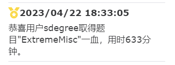

## I am Sdegree
### Nice to meet you

Offensive Security Certified Professional
 
A CTFer and trainee Redteam members
 
Mainly researching Web security and Misc direction

### **My Team:**
<a href="https://v3.cn.vuejs.org"><code></code></a><[HnuSec](http://47.107.252.179:6371/home/honor)>：My School Team
 
<a href="https://reactjs.org/"><code></code></a><[N0wayBack-SEC](https://n0wayback.com/index.html)>：University Joint Team

### **My Website：**

 <[Sdegreeの小站](https://sdegree.cn/)>
### **CVE and CNVD:**
CNVD-2024-16201
 
CNVD-2023-81523
 
CNVD-2023-77235
 
CNVD-YCGW-202309048776 （About Hikvision Already fixed）
 
And More
### Fist Blood Memorial

### Github Activation

